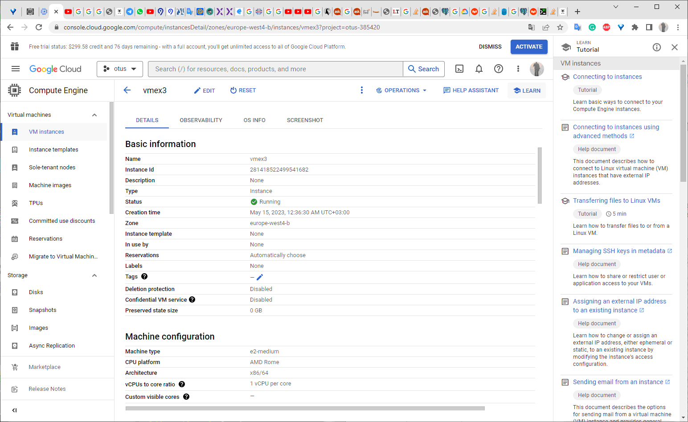

## Homework №3

- **создайте  виртуальную  машину c Ubuntu 20.04 LTS (bionic) в GCE типа e2-medium в default VPC в  любом  регионе  и  зоне, например us-central1-a или  ЯО/VirtualBox**

  Создана VM в GCP  
  
  

  
- **поставьте на нее PostgreSQL 15 через sudo apt**

Добавляен репозиторий с PostreSQL 15
`gmfcbkaccnt@vmex3:~$ sudo sh -c 'echo "deb http://apt.postgresql.org/pub/repos/apt $(lsb_release -cs)-pgdg main" > /etc/apt/sources.list.d/pgdg.list'
gmfcbkaccnt@vmex3:~$ wget --quiet -O - https://www.postgresql.org/media/keys/ACCC4CF8.asc | sudo apt-key add -
OK
gmfcbkaccnt@vmex3:~$ sudo a-t-get update`

Установлены пакеты PostgreSQL 15

`gmfcbkaccnt@vmex3:~$ sudo apt install postgresql-15 postgresql-client-15 -y
Reading package lists... Done
Building dependency tree       
Reading state information... Done
E: Unable to locate package postgresql-15`

`apt list --installed | grep postgres postgresql-15/focal-pgdg,now 15.3-1.pgdg20.04+1 amd64 [installed]
postgresql-client-15/focal-pgdg,now 15.3-1.pgdg20.04+1 amd64 [installed]
postgresql-client-common/focal-pgdg,now 249.pgdg20.04+1 all [installed,automatic]
postgresql-common/focal-pgdg,now 249.pgdg20.04+1 all [installed,automatic]`

`gmfcbkaccnt@vmex3:~$ ps -ef|grep postgres
postgres     625       1  0 19:41 ?        00:00:00 /usr/lib/postgresql/15/bin/postgres -D /var/lib/postgresql/15/main -c config_file=/etc/postgresql/15/main/postgresql.conf
postgres     634     625  0 19:41 ?        00:00:00 postgres: 15/main: checkpointer 
postgres     635     625  0 19:41 ?        00:00:00 postgres: 15/main: background writer 
postgres     637     625  0 19:41 ?        00:00:00 postgres: 15/main: walwriter 
postgres     638     625  0 19:41 ?        00:00:00 postgres: 15/main: autovacuum launcher 
postgres     639     625  0 19:41 ?        00:00:00 postgres: 15/main: logical replication launcher 
gmfcbka+    1032    1004  0 19:43 pts/0    00:00:00 grep --color=auto postgres
`

-**проверьте что кластер запущен через `sudo -u postgres pg_lsclusters`**

`gmfcbkaccnt@vmex3:~$ sudo -u postgres pg_lsclusters
Ver Cluster Port Status Owner    Data directory              Log file
15  main    5432 online postgres /var/lib/postgresql/15/main /var/log/postgresql/postgresql-15-main.log`

- **зайдите из под пользователя postgres в psql и сделайте произвольную таблицу с произвольным содержимым\
`postgres=# create table test(c1 text);\
postgres=# insert into test values('1');\
\q`**

postgres=# create table test(c1 text);
postgres=# insert into test values('1');
\q

gmfcbkaccnt@vmex3:~$ sudo -u postgres psql
psql (15.3 (Ubuntu 15.3-1.pgdg20.04+1))
Type "help" for help.

postgres=# create table test(c1 text);
CREATE TABLE
postgres=# insert into test values('1');
INSERT 0 1
postgres=# commit;
WARNING:  there is no transaction in progress
COMMIT
postgres=# select * from test;
 c1 
----
 1
(1 row)

postgres=# \dt
        List of relations
 Schema | Name | Type  |  Owner   
--------+------+-------+----------
 public | test | table | postgres
(1 row)

- **остановите postgres например через sudo -u postgres pg_ctlcluster 15 main stop**

- создайте новый standard persistent диск GKE через Compute Engine -> Disks в том же регионе и зоне что GCE инстанс размером например 10GB - или аналог в другом облаке/виртуализации

- добавьте свеже-созданный диск к виртуальной машине - надо зайти в режим ее редактирования и дальше выбрать пункт attach existing disk

- проинициализируйте диск согласно инструкции и подмонтировать файловую систему, только не забывайте менять имя диска на актуальное, в вашем случае это скорее всего будет /dev/sdb - <https://www.digitalocean.com/community/tutorials/how-to-partition-and-format-storage-devices-in-linux>

- перезагрузите инстанс и убедитесь, что диск остается примонтированным (если не так смотрим в сторону fstab)

- сделайте пользователя postgres владельцем /mnt/data - chown -R postgres:postgres /mnt/data/

- перенесите содержимое /var/lib/postgresql/15 в /mnt/data - mv /var/lib/postgresql/15 /mnt/data

- попытайтесь запустить кластер - sudo -u postgres pg_ctlcluster 15 main start

- напишите получилось или нет и почему

- задание: найти конфигурационный параметр в файлах раположенных в /etc/postgresql/14/main который надо поменять и поменяйте его

- напишите что и почему поменяли

- попытайтесь запустить кластер - sudo -u postgres pg_ctlcluster 15 main start

- напишите получилось или нет и почему

- зайдите через через psql и проверьте содержимое ранее созданной таблицы

- задание со звездочкой *: не удаляя существующий GCE инстанс/ЯО сделайте новый, поставьте на его PostgreSQL, удалите файлы с данными из /var/lib/postgresql, перемонтируйте внешний диск который сделали ранее от первой виртуальной машины ко второй и запустите PostgreSQL на второй машине так чтобы он работал с данными на внешнем диске, расскажите как вы это сделали и что в итоге получилось.
