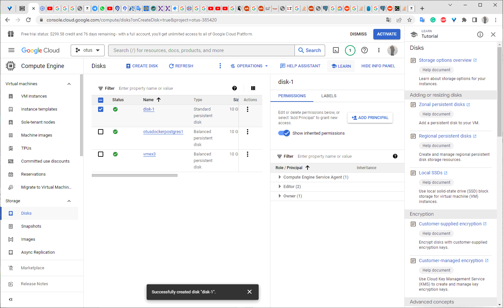
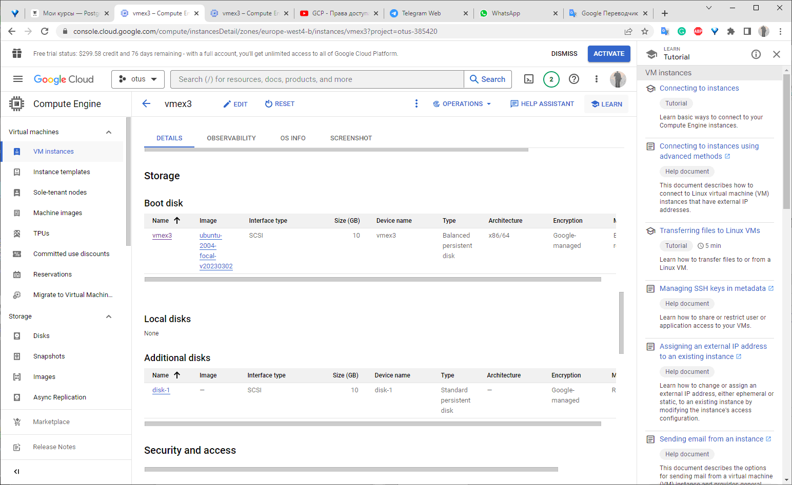

## Homework №3

- **создайте  виртуальную  машину c Ubuntu 20.04 LTS (bionic) в GCE типа e2-medium в default VPC в  любом  регионе  и  зоне, например us-central1-a или  ЯО/VirtualBox**

  Создана VM в GCP  
  
  

  
- **поставьте на нее PostgreSQL 15 через sudo apt**

Добавляен репозиторий с PostreSQL 15
`gmfcbkaccnt@vmex3:~$ sudo sh -c 'echo "deb http://apt.postgresql.org/pub/repos/apt $(lsb_release -cs)-pgdg main" > /etc/apt/sources.list.d/pgdg.list'
gmfcbkaccnt@vmex3:~$ wget --quiet -O - https://www.postgresql.org/media/keys/ACCC4CF8.asc | sudo apt-key add -
OK
gmfcbkaccnt@vmex3:~$ sudo a-t-get update`

Установлены пакеты PostgreSQL 15

`gmfcbkaccnt@vmex3:~$ sudo apt install postgresql-15 postgresql-client-15 -y
Reading package lists... Done
Building dependency tree       
Reading state information... Done
E: Unable to locate package postgresql-15`

`apt list --installed | grep postgres postgresql-15/focal-pgdg,now 15.3-1.pgdg20.04+1 amd64 [installed]
postgresql-client-15/focal-pgdg,now 15.3-1.pgdg20.04+1 amd64 [installed]
postgresql-client-common/focal-pgdg,now 249.pgdg20.04+1 all [installed,automatic]
postgresql-common/focal-pgdg,now 249.pgdg20.04+1 all [installed,automatic]`

`gmfcbkaccnt@vmex3:~$ ps -ef|grep postgres
postgres     625       1  0 19:41 ?        00:00:00 /usr/lib/postgresql/15/bin/postgres -D /var/lib/postgresql/15/main -c config_file=/etc/postgresql/15/main/postgresql.conf
postgres     634     625  0 19:41 ?        00:00:00 postgres: 15/main: checkpointer 
postgres     635     625  0 19:41 ?        00:00:00 postgres: 15/main: background writer 
postgres     637     625  0 19:41 ?        00:00:00 postgres: 15/main: walwriter 
postgres     638     625  0 19:41 ?        00:00:00 postgres: 15/main: autovacuum launcher 
postgres     639     625  0 19:41 ?        00:00:00 postgres: 15/main: logical replication launcher 
gmfcbka+    1032    1004  0 19:43 pts/0    00:00:00 grep --color=auto postgres
`

- **проверьте что кластер запущен через `sudo -u postgres pg_lsclusters`**

`gmfcbkaccnt@vmex3:~$ sudo -u postgres pg_lsclusters
Ver Cluster Port Status Owner    Data directory              Log file
15  main    5432 online postgres /var/lib/postgresql/15/main /var/log/postgresql/postgresql-15-main.log`

- зайдите из под пользователя postgres в psql и сделайте произвольную таблицу с произвольным содержимым\
`postgres=# create table test(c1 text);\
postgres=# insert into test values('1');\
\q`

`postgres=# create table test(c1 text);
postgres=# insert into test values('1');
\q`

`postgres=# create table test(c1 text);
CREATE TABLE
postgres=# insert into test values('1');
INSERT 0 1
;`

`
postgres=# \dt
        List of relations
 Schema | Name | Type  |  Owner   
--------+------+-------+----------
 public | test | table | postgres
(1 row)`

- **остановите postgres например через sudo -u postgres pg_ctlcluster 15 main stop**
`gmfcbkaccnt@vmex3:~$ sudo -u postgres pg_ctlcluster 15 main status
pg_ctl: server is running (PID: 625)
/usr/lib/postgresql/15/bin/postgres "-D" "/var/lib/postgresql/15/main" "-c" "config_file=/etc/postgresql/15/main/postgresql.conf"
gmfcbkaccnt@vmex3:~$ sudo -u postgres pg_ctlcluster 15 main stop
Warning: stopping the cluster using pg_ctlcluster will mark the systemd unit as failed. Consider using systemctl:
  sudo systemctl stop postgresql@15-main
gmfcbkaccnt@vmex3:~$ sudo -u postgres pg_ctlcluster 15 main status
pg_ctl: no server running`

- **создайте новый standard persistent диск GKE через Compute Engine -> Disks в том же регионе и зоне что GCE инстанс размером например 10GB - или аналог в другом облаке/виртуализации**

- **добавьте свеже-созданный диск к виртуальной машине - надо зайти в режим ее редактирования и дальше выбрать пункт attach existing disk**

- **проинициализируйте диск согласно инструкции и подмонтировать файловую систему, только не забывайте менять имя диска на актуальное, в вашем случае это скорее всего будет /dev/sdb - <https://www.digitalocean.com/community/tutorials/how-to-partition-and-format-storage-devices-in-linux>**

--проверяем наличие утилиты parted

gmfcbkaccnt@vmex3:~$ which parted

/usr/sbin/parted

gmfcbkaccnt@vmex3:~$

--Определяем новый диск в системе

gmfcbkaccnt@vmex3:~$ lsblk

NAME    MAJ:MIN RM   SIZE RO TYPE MOUNTPOINT

loop0     7:0    0  55.6M  1 loop /snap/core18/2697

loop1     7:1    0  55.7M  1 loop /snap/core18/2745

loop2     7:2    0  63.3M  1 loop /snap/core20/1822

loop3     7:3    0 337.9M  1 loop /snap/google-cloud-cli/111

loop4     7:4    0   335M  1 loop /snap/google-cloud-cli/131

loop5     7:5    0  91.9M  1 loop /snap/lxd/24061

loop6     7:6    0  49.9M  1 loop /snap/snapd/18357

loop7     7:7    0  53.2M  1 loop /snap/snapd/19122

sda       8:0    0    10G  0 disk

├─sda1    8:1    0   9.9G  0 part /

├─sda14   8:14   0     4M  0 part

└─sda15   8:15   0   106M  0 part /boot/efi

sdb       8:16   0    10G  0 disk

gmfcbkaccnt@vmex3:~$

gmfcbkaccnt@vmex3:~$ sudo parted -l | grep Error

Error: /dev/sdb: unrecognised disk label

gmfcbkaccnt@vmex3:~$ lsblk -l

NAME  MAJ:MIN RM   SIZE RO TYPE MOUNTPOINT

loop0   7:0    0  55.6M  1 loop /snap/core18/2697

loop1   7:1    0  55.7M  1 loop /snap/core18/2745

loop2   7:2    0  63.3M  1 loop /snap/core20/1822

loop3   7:3    0 337.9M  1 loop /snap/google-cloud-cli/111

loop4   7:4    0   335M  1 loop /snap/google-cloud-cli/131

loop5   7:5    0  91.9M  1 loop /snap/lxd/24061

loop6   7:6    0  49.9M  1 loop /snap/snapd/18357

loop7   7:7    0  53.2M  1 loop /snap/snapd/19122

sda     8:0    0    10G  0 disk

sda1    8:1    0   9.9G  0 part /

sda14   8:14   0     4M  0 part

sda15   8:15   0   106M  0 part /boot/efi

sdb     8:16   0    10G  0 disk

--Создаем новый раздел

gmfcbkaccnt@vmex3:~$ sudo parted /dev/sdb mklabel gpt

Information: You may need to update /etc/fstab.

gmfcbkaccnt@vmex3:~$ sudo parted -a opt /dev/sdb mkpart primary ext4 0% 100%

Information: You may need to update /etc/fstab.

gmfcbkaccnt@vmex3:~$ lsblk -l

NAME  MAJ:MIN RM   SIZE RO TYPE MOUNTPOINT

loop0   7:0    0  55.6M  1 loop /snap/core18/2697

loop1   7:1    0  55.7M  1 loop /snap/core18/2745

loop2   7:2    0  63.3M  1 loop /snap/core20/1822

loop3   7:3    0 337.9M  1 loop /snap/google-cloud-cli/111

loop4   7:4    0   335M  1 loop /snap/google-cloud-cli/131

loop5   7:5    0  91.9M  1 loop /snap/lxd/24061

loop6   7:6    0  49.9M  1 loop /snap/snapd/18357

loop7   7:7    0  53.2M  1 loop /snap/snapd/19122

sda     8:0    0    10G  0 disk

sda1    8:1    0   9.9G  0 part /

sda14   8:14   0     4M  0 part

sda15   8:15   0   106M  0 part /boot/efi

sdb     8:16   0    10G  0 disk

sdb1    8:17   0    10G  0 part

gmfcbkaccnt@vmex3:~$

--Создаем файловую систему на новом разделе

fcbkaccnt@vmex3:~$ sudo mkfs.ext4 -L extdisk1 /dev/sdb1

mke2fs 1.45.5 (07-Jan-2020)

Discarding device blocks: done                           

Creating filesystem with 2620928 4k blocks and 655360 inodes

Filesystem UUID: ee0459ed-2bbd-41a1-a047-96f9a9af15bd

Superblock backups stored on blocks:

        32768, 98304, 163840, 229376, 294912, 819200, 884736, 1605632

Allocating group tables: done                           

Writing inode tables: done                            

Creating journal (16384 blocks): done

Writing superblocks and filesystem accounting information: done

gmfcbkaccnt@vmex3:~$ lsblk -l

NAME  MAJ:MIN RM   SIZE RO TYPE MOUNTPOINT

loop0   7:0    0  55.6M  1 loop /snap/core18/2697

loop1   7:1    0  55.7M  1 loop /snap/core18/2745

loop2   7:2    0  63.3M  1 loop /snap/core20/1822

loop3   7:3    0 337.9M  1 loop /snap/google-cloud-cli/111

loop4   7:4    0   335M  1 loop /snap/google-cloud-cli/131

loop5   7:5    0  91.9M  1 loop /snap/lxd/24061

loop6   7:6    0  49.9M  1 loop /snap/snapd/18357

loop7   7:7    0  53.2M  1 loop /snap/snapd/19122

sda     8:0    0    10G  0 disk

sda1    8:1    0   9.9G  0 part /

sda14   8:14   0     4M  0 part

sda15   8:15   0   106M  0 part /boot/efi

sdb     8:16   0    10G  0 disk

sdb1    8:17   0    10G  0 part

gmfcbkaccnt@vmex3:~$

--Смонтируем новую файловую систему

gmfcbkaccnt@vmex3:~$ sudo mkdir -p /mnt/data

gmfcbkaccnt@vmex3:~$ sudo mount -o defaults /dev/sdb1 /mnt/data

gmfcbkaccnt@vmex3:~$ mount -l

/*w

sdb                                                                                

└─sdb1

     ext4   1.0   extdisk1     ee0459ed-2bbd-41a1-a047-96f9a9af15bd

*/

/dev/sdb1 on /mnt/data type ext4 (rw,relatime) [extdisk1]

gmfcbkaccnt@vmex3:~$ sudo lsblk --fs

NAME    FSTYPE   LABEL           UUID                                 FSAVAIL FSUSE% MOUNTPOINT

loop0   squashfs                                                            0   100% /snap/core18/2697

loop1   squashfs                                                            0   100% /snap/core18/2745

loop2   squashfs                                                            0   100% /snap/core20/1822

loop3   squashfs                                                            0   100% /snap/google-cloud-cli/111

loop4   squashfs                                                            0   100% /snap/google-cloud-cli/131

loop5   squashfs                                                            0   100% /snap/lxd/24061

loop6   squashfs                                                            0   100% /snap/snapd/18357

loop7   squashfs                                                            0   100% /snap/snapd/19122

sda                                                                                 

├─sda1  ext4     cloudimg-rootfs c239b55f-4d16-47ed-9eea-dc814bf8f669    6.5G    31% /

├─sda14                                                                             

└─sda15 vfat     UEFI            8674-B1A4                              98.3M     6% /boot/efi

sdb                                                                                 

└─sdb1  ext4     extdisk1        ee0459ed-2bbd-41a1-a047-96f9a9af15bd    9.2G     0% /mnt/data

gmfcbkaccnt@vmex3:~$

gmfcbkaccnt@vmex3:~$ sudo vi /etc/fstab

gmfcbkaccnt@vmex3:~$ df -h

Filesystem      Size  Used Avail Use% Mounted on

/dev/root       9.6G  3.0G  6.6G  32% /

devtmpfs        2.0G     0  2.0G   0% /dev

tmpfs           2.0G     0  2.0G   0% /dev/shm

tmpfs           393M  960K  392M   1% /run

tmpfs           5.0M     0  5.0M   0% /run/lock

tmpfs           2.0G     0  2.0G   0% /sys/fs/cgroup

/dev/loop0       56M   56M     0 100% /snap/core18/2697

/dev/loop1       56M   56M     0 100% /snap/core18/2745

/dev/loop2       64M   64M     0 100% /snap/core20/1822

/dev/loop3      338M  338M     0 100% /snap/google-cloud-cli/111

/dev/loop4      336M  336M     0 100% /snap/google-cloud-cli/131

/dev/loop5       92M   92M     0 100% /snap/lxd/24061

/dev/loop6       50M   50M     0 100% /snap/snapd/18357

/dev/loop7       54M   54M     0 100% /snap/snapd/19122

/dev/sda15      105M  6.1M   99M   6% /boot/efi

tmpfs           393M     0  393M   0% /run/user/1001

/dev/sdb1       9.8G   24K  9.3G   1% /mnt/data

gmfcbkaccnt@vmex3:~$ sudo vi /etc/fstab

gmfcbkaccnt@vmex3:~$ sudo mount -a

gmfcbkaccnt@vmex3:~$ cat vi /etc/fstab

cat: vi: No such file or directory

LABEL=cloudimg-rootfs   /        ext4   defaults        0 1

LABEL=UEFI      /boot/efi       vfat    umask=0077      0 1

UUID=ee0459ed-2bbd-41a1-a047-96f9a9af15bd /mnt/data ext4 defaults 0 2

- **перезагрузите инстанс и убедитесь, что диск остается примонтированным (если не так смотрим в сторону fstab)**

- **сделайте пользователя postgres владельцем /mnt/data - chown -R postgres:postgres /mnt/data/**

- **перенесите содержимое /var/lib/postgresql/15 в /mnt/data - mv /var/lib/postgresql/15 /mnt/data**

- **попытайтесь запустить кластер - sudo -u postgres pg_ctlcluster 15 main start**

- **напишите получилось или нет и почему**

- **задание: найти конфигурационный параметр в файлах раположенных в /etc/postgresql/14/main который надо поменять и поменяйте его**

- **напишите что и почему поменяли**

- **попытайтесь запустить кластер - sudo -u postgres pg_ctlcluster 15 main start**

- **напишите получилось или нет и почему**

- зайдите через через psql и проверьте содержимое ранее созданной таблицы

- задание со звездочкой *: не удаляя существующий GCE инстанс/ЯО сделайте новый, поставьте на его PostgreSQL, удалите файлы с данными из /var/lib/postgresql, перемонтируйте внешний диск который сделали ранее от первой виртуальной машины ко второй и запустите PostgreSQL на второй машине так чтобы он работал с данными на внешнем диске, расскажите как вы это сделали и что в итоге получилось.

[def]: img/createVM_gCP_newdisk.png