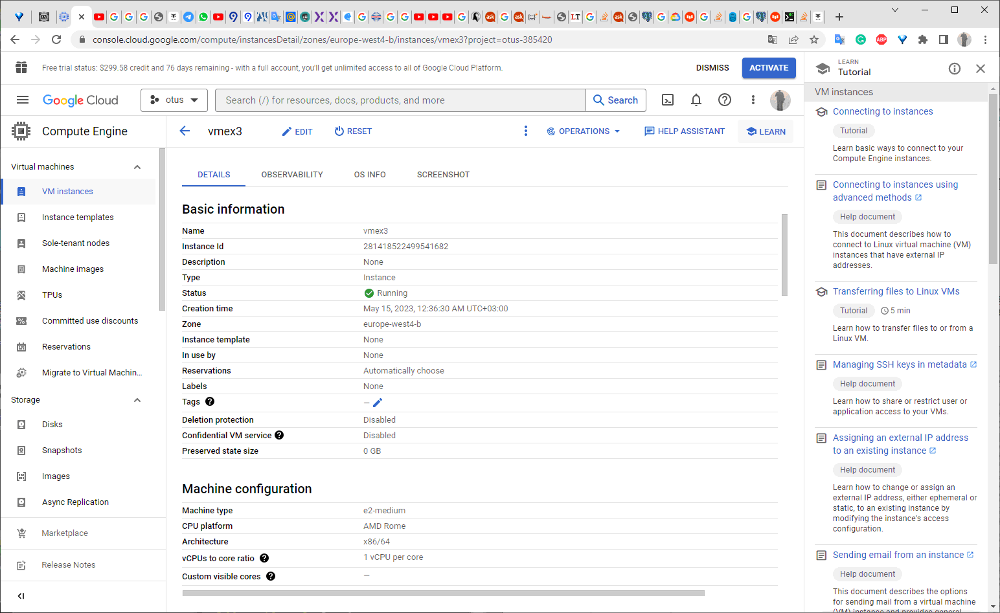
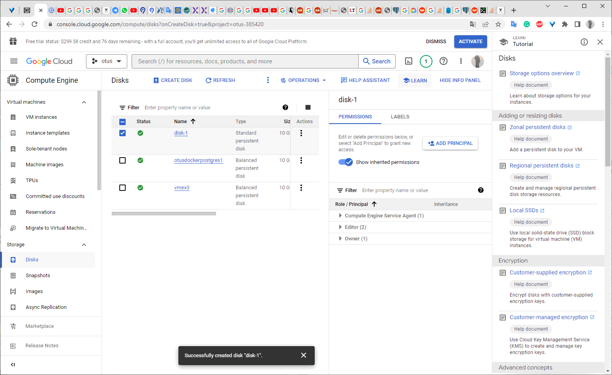
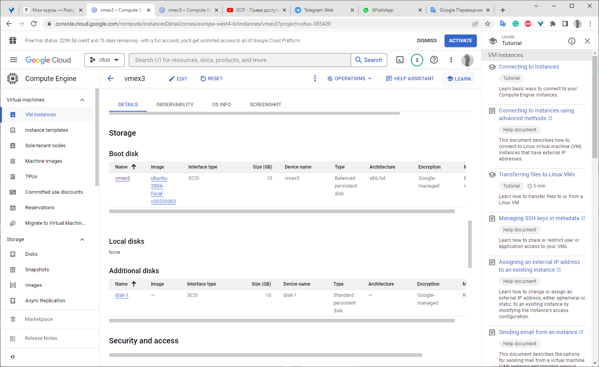
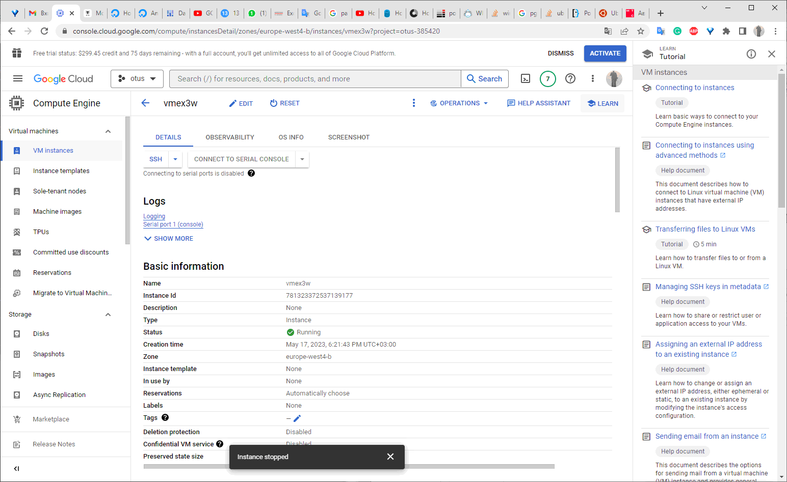
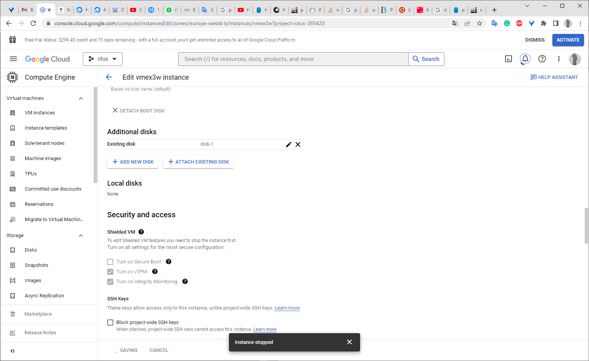

## Homework №3

- **создайте  виртуальную  машину c Ubuntu 20.04 LTS (bionic) в GCE типа e2-medium в default VPC в  любом  регионе  и  зоне, например us-central1-a или  ЯО/VirtualBox**

 #### *Создана VM в GCP*
  
  

  
- **поставьте на нее PostgreSQL 15 через sudo apt**

#### *Добавляен репозиторий с PostreSQL 15*

gmfcbkaccnt@vmex3:~$ `sudo sh -c 'echo "deb http://apt.postgresql.org/pub/repos/apt $
(lsb_release -cs)-pgdg main" > /etc/apt/sources.list.d/pgdg.list'`

gmfcbkaccnt@vmex3:~$ `wget --quiet -O - https://www.postgresql.org/media/keys/ACCC4CF8.asc | sudo apt-key add -`

OK

gmfcbkaccnt@vmex3:~$ `sudo a-t-get update`

#### *Установлены пакеты PostgreSQL 15*

gmfcbkaccnt@vmex3:~$ `sudo apt install postgresql-15 postgresql-client-15 -y`

Reading package lists... Done

Building dependency tree       

Reading state information... Done

E: Unable to locate package postgresql-15

gmfcbkaccnt@vmex3:~$ `apt list --installed | grep postgres postgresql-15`
focal-pgdg,now 15.3-1.pgdg20.04+1 amd64 [installed]

postgresql-client-15/focal-pgdg,now 15.3-1.pgdg20.04+1 amd64 [installed]

postgresql-client-common/focal-pgdg,now 249.pgdg20.04+1 all [installed,automatic]

postgresql-common/focal-pgdg,now 249.pgdg20.04+1 all [installed,automatic]

gmfcbkaccnt@vmex3:~$ `gmfcbkaccnt@vmex3:~$ ps -ef|grep postgres`
postgres     625       1  0 19:41 ?        00:00:00 /usr/lib/postgresql/15/bin/postgres -D /var/lib/postgresql/15/main -c config_file=/etc/postgresql/15/main/postgresql.conf

postgres     634     625  0 19:41 ?        00:00:00 postgres: 15/main: checkpointer 

postgres     635     625  0 19:41 ?        00:00:00 postgres: 15/main: background writer 

postgres     637     625  0 19:41 ?        00:00:00 postgres: 15/main: walwriter 

postgres     638     625  0 19:41 ?        00:00:00 postgres: 15/main: autovacuum launcher 

postgres     639     625  0 19:41 ?        00:00:00 postgres: 15/main: logical replication launcher 

gmfcbka+    1032    1004  0 19:43 pts/0    00:00:00 grep --color=auto postgres

- **проверьте что кластер запущен через `sudo -u postgres pg_lsclusters`**

gmfcbkaccnt@vmex3:~$ `sudo -u postgres pg_lsclusters`

Ver Cluster Port Status Owner    Data directory              Log file

15  main    5432 online postgres /var/lib/postgresql/15/main /var/log/postgresql/postgresql-15-main.log`

- **зайдите из под пользователя postgres в psql и сделайте произвольную таблицу с произвольным содержимым**
  
postgres=# `create table test(c1 text);\`

postgres=# `insert into test values('1');`

postgres=# `create table test(c1 text);`
postgres=# `insert into test values('1');`

postgres=# `create table test(c1 text);`

CREATE TABLE

postgres=# `insert into test values('1');`

INSERT 0 1

postgres=# \dt

List of relations

 Schema | Name | Type  |  Owner   
--------+------+-------+----------

 public | test | table | postgres

(1 row)`

- **остановите postgres например через sudo -u postgres pg_ctlcluster 15 main stop**
  
gmfcbkaccnt@vmex3:~$ `sudo -u postgres pg_ctlcluster 15 main status`

pg_ctl: server is running (PID: 625)

/usr/lib/postgresql/15/bin/postgres "-D" "/var/lib/postgresql/15/main" "-c" "config_file=/etc/postgresql/15/main/postgresql.conf"

gmfcbkaccnt@vmex3:~$ `sudo -u postgres pg_ctlcluster 15 main stop`

Warning: stopping the cluster using pg_ctlcluster will mark the systemd unit as failed. Consider using systemctl:
  sudo systemctl stop postgresql@15-main

- **создайте новый standard persistent диск GKE через Compute Engine -> Disks в том же регионе и зоне что GCE инстанс размером например 10GB - или аналог в другом облаке/виртуализации**

- **добавьте свеже-созданный диск к виртуальной машине - надо зайти в режим ее редактирования и дальше выбрать пункт attach existing disk**

- **проинициализируйте диск согласно инструкции и подмонтировать файловую систему, только не забывайте менять имя диска на актуальное, в вашем случае это скорее всего будет /dev/sdb - <https://www.digitalocean.com/community/tutorials/how-to-partition-and-format-storage-devices-in-linux>**

#### *Проверяем наличие утилиты parted*

gmfcbkaccnt@vmex3:~$ `which parted`

/usr/sbin/parted

#### *Определяем новый диск в системе*

gmfcbkaccnt@vmex3:~$ `lsblk`

NAME    MAJ:MIN RM   SIZE RO TYPE MOUNTPOINT

loop0     7:0    0  55.6M  1 loop /snap/core18/2697

loop1     7:1    0  55.7M  1 loop /snap/core18/2745

loop2     7:2    0  63.3M  1 loop /snap/core20/1822

loop3     7:3    0 337.9M  1 loop /snap/google-cloud-cli/111

loop4     7:4    0   335M  1 loop /snap/google-cloud-cli/131

loop5     7:5    0  91.9M  1 loop /snap/lxd/24061

loop6     7:6    0  49.9M  1 loop /snap/snapd/18357

loop7     7:7    0  53.2M  1 loop /snap/snapd/19122

sda       8:0    0    10G  0 disk

├─sda1    8:1    0   9.9G  0 part /

├─sda14   8:14   0     4M  0 part

└─sda15   8:15   0   106M  0 part /boot/efi

sdb       8:16   0    10G  0 disk

gmfcbkaccnt@vmex3:~$ `sudo parted -l | grep Error`

Error: /dev/sdb: unrecognised disk label

gmfcbkaccnt@vmex3:~$ `lsblk -l`

NAME  MAJ:MIN RM   SIZE RO TYPE MOUNTPOINT

loop0   7:0    0  55.6M  1 loop /snap/core18/2697

loop1   7:1    0  55.7M  1 loop /snap/core18/2745

loop2   7:2    0  63.3M  1 loop /snap/core20/1822

loop3   7:3    0 337.9M  1 loop /snap/google-cloud-cli/111

loop4   7:4    0   335M  1 loop /snap/google-cloud-cli/131

loop5   7:5    0  91.9M  1 loop /snap/lxd/24061

loop6   7:6    0  49.9M  1 loop /snap/snapd/18357

loop7   7:7    0  53.2M  1 loop /snap/snapd/19122

sda     8:0    0    10G  0 disk

sda1    8:1    0   9.9G  0 part /

sda14   8:14   0     4M  0 part

sda15   8:15   0   106M  0 part /boot/efi

sdb     8:16   0    10G  0 disk

#### *Создаем новый раздел*

gmfcbkaccnt@vmex3:~$ `sudo parted /dev/sdb mklabel gpt`

Information: You may need to update /etc/fstab.

gmfcbkaccnt@vmex3:~$ `sudo parted -a opt /dev/sdb mkpart primary ext4 0% 100%`

Information: You may need to update /etc/fstab.

gmfcbkaccnt@vmex3:~$` lsblk -l`

NAME  MAJ:MIN RM   SIZE RO TYPE MOUNTPOINT

loop0   7:0    0  55.6M  1 loop /snap/core18/2697

loop1   7:1    0  55.7M  1 loop /snap/core18/2745

loop2   7:2    0  63.3M  1 loop /snap/core20/1822

loop3   7:3    0 337.9M  1 loop /snap/google-cloud-cli/111

loop4   7:4    0   335M  1 loop /snap/google-cloud-cli/131

loop5   7:5    0  91.9M  1 loop /snap/lxd/24061

loop6   7:6    0  49.9M  1 loop /snap/snapd/18357

loop7   7:7    0  53.2M  1 loop /snap/snapd/19122

sda     8:0    0    10G  0 disk

sda1    8:1    0   9.9G  0 part /

sda14   8:14   0     4M  0 part

sda15   8:15   0   106M  0 part /boot/efi

sdb     8:16   0    10G  0 disk

sdb1    8:17   0    10G  0 part

#### *Создаем файловую систему на новом разделе*

fcbkaccnt@vmex3:~$ `sudo mkfs.ext4 -L extdisk1 /dev/sdb1`

mke2fs 1.45.5 (07-Jan-2020)

Discarding device blocks: done                           

Creating filesystem with 2620928 4k blocks and 655360 inodes

Filesystem UUID: ee0459ed-2bbd-41a1-a047-96f9a9af15bd

Superblock backups stored on blocks:

        32768, 98304, 163840, 229376, 294912, 819200, 884736, 1605632

Allocating group tables: done                           

Writing inode tables: done                            

Creating journal (16384 blocks): done

Writing superblocks and filesystem accounting information: done

gmfcbkaccnt@vmex3:~$ `lsblk -l`

NAME  MAJ:MIN RM   SIZE RO TYPE MOUNTPOINT

loop0   7:0    0  55.6M  1 loop /snap/core18/2697

loop1   7:1    0  55.7M  1 loop /snap/core18/2745

loop2   7:2    0  63.3M  1 loop /snap/core20/1822

loop3   7:3    0 337.9M  1 loop /snap/google-cloud-cli/111

loop4   7:4    0   335M  1 loop /snap/google-cloud-cli/131

loop5   7:5    0  91.9M  1 loop /snap/lxd/24061

loop6   7:6    0  49.9M  1 loop /snap/snapd/18357

loop7   7:7    0  53.2M  1 loop /snap/snapd/19122

sda     8:0    0    10G  0 disk

sda1    8:1    0   9.9G  0 part /

sda14   8:14   0     4M  0 part

sda15   8:15   0   106M  0 part /boot/efi

sdb     8:16   0    10G  0 disk

sdb1    8:17   0    10G  0 part

#### *Смонтируем новую файловую систему*

gmfcbkaccnt@vmex3:~$ `sudo mkdir -p /mnt/data`

gmfcbkaccnt@vmex3:~$ `sudo mount -o defaults /dev/sdb1 /mnt/data`

gmfcbkaccnt@vmex3:~$ `mount -l`

/dev/sdb1 on /mnt/data type ext4 (rw,relatime) [extdisk1]

gmfcbkaccnt@vmex3:~$ `sudo lsblk --fs`

NAME    FSTYPE   LABEL           UUID                                 FSAVAIL FSUSE% MOUNTPOINT

loop0   squashfs                                                            0   100% /snap/core18/2697

loop1   squashfs                                                            0   100% /snap/core18/2745

loop2   squashfs                                                            0   100% /snap/core20/1822

loop3   squashfs                                                            0   100% /snap/google-cloud-cli/111

loop4   squashfs                                                            0   100% /snap/google-cloud-cli/131

loop5   squashfs                                                            0   100% /snap/lxd/24061

loop6   squashfs                                                            0   100% /snap/snapd/18357

loop7   squashfs                                                            0   100% /snap/snapd/19122

sda                                                                                 

├─sda1  ext4     cloudimg-rootfs c239b55f-4d16-47ed-9eea-dc814bf8f669    6.5G    31% /

├─sda14                                                                             

└─sda15 vfat     UEFI            8674-B1A4                              98.3M     6% /boot/efi

sdb                                                                                 

└─sdb1  ext4     extdisk1        ee0459ed-2bbd-41a1-a047-96f9a9af15bd    9.2G     0% /mnt/data

gmfcbkaccnt@vmex3:~$ `sudo vi /etc/fstab`

gmfcbkaccnt@vmex3:~$ `df -h`

Filesystem      Size  Used Avail Use% Mounted on

/dev/root       9.6G  3.0G  6.6G  32% /

devtmpfs        2.0G     0  2.0G   0% /dev

tmpfs           2.0G     0  2.0G   0% /dev/shm

tmpfs           393M  960K  392M   1% /run

tmpfs           5.0M     0  5.0M   0% /run/lock

tmpfs           2.0G     0  2.0G   0% /sys/fs/cgroup

/dev/loop0       56M   56M     0 100% /snap/core18/2697

/dev/loop1       56M   56M     0 100% /snap/core18/2745

/dev/loop2       64M   64M     0 100% /snap/core20/1822

/dev/loop3      338M  338M     0 100% /snap/google-cloud-cli/111

/dev/loop4      336M  336M     0 100% /snap/google-cloud-cli/131

/dev/loop5       92M   92M     0 100% /snap/lxd/24061

/dev/loop6       50M   50M     0 100% /snap/snapd/18357

/dev/loop7       54M   54M     0 100% /snap/snapd/19122

/dev/sda15      105M  6.1M   99M   6% /boot/efi

tmpfs           393M     0  393M   0% /run/user/1001

/dev/sdb1       9.8G   24K  9.3G   1% /mnt/data

gmfcbkaccnt@vmex3:~$ `sudo mount -a`

gmfcbkaccnt@vmex3:~$ `cat vi /etc/fstab`

cat: vi: No such file or directory

LABEL=cloudimg-rootfs   /        ext4   defaults        0 1

LABEL=UEFI      /boot/efi       vfat    umask=0077      0 1

UUID=ee0459ed-2bbd-41a1-a047-96f9a9af15bd /mnt/data ext4 defaults 0 2

#### *Проверяем доступность диска*

mfcbkaccnt@vmex3:~$ `echo "success" | sudo tee /mnt/data/test_file`

success

gmfcbkaccnt@vmex3:~$ `cat /mnt/data/test_file`

success
- **перезагрузите инстанс и убедитесь, что диск остается примонтированным (если не так смотрим в сторону fstab)**
  
  gmfcbkaccnt@vmex3:~$  `sudo reboot`

gmfcbkaccnt@vmex3:~$ `df -h`

Filesystem      Size  Used Avail Use% Mounted on

/dev/root       9.6G  3.0G  6.6G  32% /

devtmpfs        2.0G     0  2.0G   0% /dev

tmpfs           2.0G  1.1M  2.0G   1% /dev/shm

tmpfs           393M  952K  392M   1% /run

tmpfs           5.0M     0  5.0M   0% /run/lock

tmpfs           2.0G     0  2.0G   0% /sys/fs/cgroup

/dev/loop0       56M   56M     0 100% /snap/core18/2745

/dev/loop1       56M   56M     0 100% /snap/core18/2697

/dev/loop2       64M   64M     0 100% /snap/core20/1822

/dev/loop3      338M  338M     0 100% /snap/google-cloud-cli/111

/dev/loop4       92M   92M     0 100% /snap/lxd/24061

/dev/loop5      336M  336M     0 100% /snap/google-cloud-cli/131

/dev/loop6       50M   50M     0 100% /snap/snapd/18357

/dev/loop7       54M   54M     0 100% /snap/snapd/19122

/dev/sdb1       9.8G   28K  9.3G   1% /mnt/data

/dev/sda15      105M  6.1M   99M   6% /boot/efi

tmpfs           393M     0  393M   0% /run/user/1001

- **сделайте пользователя postgres владельцем /mnt/data - chown -R postgres:postgres /mnt/data/**

gmfcbkaccnt@vmex3:~$ `ls -ltd /mnt/data/`

drwxr-xr-x 3 root root 4096 May 16 20:37 /mnt/data/

gmfcbkaccnt@vmex3:~$ sudo chown -R postgres:postgres /mnt/data/

gmfcbkaccnt@vmex3:~$ ls -ltd /mnt/data/

drwxr-xr-x 3 postgres postgres 4096 May 16 20:37 /mnt/data/

- **перенесите содержимое /var/lib/postgresql/15 в /mnt/data - mv /var/lib/postgresql/15 /mnt/data**

#### *Смотрим состояние статуса БД после перезагрузки*

gmfcbkaccnt@vmex3:~$ `sudo -u postgres pg_ctlcluster 15 main status`

pg_ctl: server is running (PID: 656)

/usr/lib/postgresql/15/bin/postgres "-D" "/var/lib/postgresql/15/main" "-c" "config_file=/etc/postgresql/15/main/postgresql.conf"

gmfcbkaccnt@vmex3:~$ `ps -efl|grep postgres`

0 S postgres     656       1  0  80   0 - 54806 -      20:39 ?        00:00:00

/usr/lib/postgresql/15/bin/postgres -D /var/lib/postgresql/15/main -c config_file=/etc/postgresql/15/main/postgresql.conf

1 S postgres     657     656  0  80   0 - 54839 -      20:39 ?        00:00:00 postgres: 15/main: checkpointer

1 S postgres     658     656  0  80   0 - 54843 -      20:39 ?        00:00:00 postgres: 15/main: background writer

1 S postgres     660     656  0  80   0 - 54806 -      20:39 ?        00:00:00 postgres: 15/main: walwriter

1 S postgres     661     656  0  80   0 - 55204 -      20:39 ?        00:00:00 postgres: 15/main: autovacuum launcher

1 S postgres     662     656  0  80   0 - 55200 -      20:39 ?        00:00:00 postgres: 15/main: logical replication launcher

0 S gmfcbka+    1109    1049  0  80   0 -  2042 pipe_r 20:45 pts/0    00:00:00 grep --color=auto postgres

gmfcbkaccnt@vmex3:~$ `sudo -u postgres pg_ctlcluster 15 main stop`

Warning: stopping the cluster using pg_ctlcluster will mark the systemd unit as failed. Consider using systemctl:

  sudo systemctl stop postgresql@15-main

gmfcbkaccnt@vmex3:~$ `ps -efl|grep postgres`

0 S gmfcbka+    1118    1049  0  80   0 -  2042 pipe_r 20:46 pts/0    00:00:00 grep --color=auto postgres

gmfcbkaccnt@vmex3:~$ `sudo du -hs /var/lib/postgresql/15`

39M     /var/lib/postgresql/15

gmfcbkaccnt@vmex3:~$ `sudo ls -lrta /var/lib/postgresql/15`

total 12

drwxr-xr-x  3 postgres postgres 4096 May 15 16:35 .

drwxr-xr-x  3 postgres postgres 4096 May 16 19:52 ..

drwx------ 19 postgres postgres 4096 May 16 20:45 main

gmfcbkaccnt@vmex3:~$` sudo ls -lrta /var/lib/postgresql/15/main/`

total 88

drwxr-xr-x  3 postgres postgres 4096 May 15 16:35 ..

drwx------  2 postgres postgres 4096 May 15 16:35 pg_twophase

drwx------  2 postgres postgres 4096 May 15 16:35 pg_tblspc

drwx------  2 postgres postgres 4096 May 15 16:35 pg_stat_tmp

drwx------  2 postgres postgres 4096 May 15 16:35 pg_snapshots

drwx------  2 postgres postgres 4096 May 15 16:35 pg_serial

drwx------  2 postgres postgres 4096 May 15 16:35 pg_replslot

drwx------  2 postgres postgres 4096 May 15 16:35 pg_notify

drwx------  4 postgres postgres 4096 May 15 16:35 pg_multixact

drwx------  2 postgres postgres 4096 May 15 16:35 pg_dynshmem

drwx------  2 postgres postgres 4096 May 15 16:35 pg_commit_ts

-rw-------  1 postgres postgres    3 May 15 16:35 PG_VERSION

-rw-------  1 postgres postgres   88 May 15 16:35 postgresql.auto.conf

drwx------  2 postgres postgres 4096 May 15 16:35 pg_xact

drwx------  3 postgres postgres 4096 May 15 16:35 pg_wal

drwx------  2 postgres postgres 4096 May 15 16:35 pg_subtrans

drwx------  5 postgres postgres 4096 May 15 16:35 base

-rw-------  1 postgres postgres  130 May 16 20:39 postmaster.opts

drwx------  2 postgres postgres 4096 May 16 20:40 global

drwx------  4 postgres postgres 4096 May 16 20:45 pg_logical

drwx------  2 postgres postgres 4096 May 16 20:45 pg_stat

drwx------ 19 postgres postgres 4096 May 16 20:45 .

gmfcbkaccnt@vmex3:~$` ls -lrt   /mnt/data/`

total 20

drwx------ 2 postgres postgres 16384 May 16 20:19 lost+found

-rw-r--r-- 1 postgres postgres     8 May 16 20:37 test_file

gmfcbkaccnt@vmex3:~$ `sudo  -u postgres mv /var/lib/postgresql/15 /mnt/data`

gmfcbkaccnt@vmex3:~$ `ls -lrt   /mnt/data/`

total 24

drwxr-xr-x 3 postgres postgres  4096 May 15 16:35 15

drwx------ 2 postgres postgres 16384 May 16 20:19 lost+found

-rw-r--r-- 1 postgres postgres     8 May 16 20:37 test_file

gmfcbkaccnt@vmex3:~$ `sudo  du -hs /mnt/data/15/`

39M     /mnt/data/15/

- **попытайтесь запустить кластер - sudo -u postgres pg_ctlcluster 15 main start**
gmfcbkaccnt@vmex3:~$ `sudo -u postgres pg_ctlcluster 15 main start`

Error: /var/lib/postgresql/15/main is not accessible or does not exist

### *НЕ запустится кластер БД -в конфигурационном файле информация о старом местоположении*

### *Меняем файл postgresql.conf  параметр data_directory*

gmfcbkaccnt@vmex3:/etc/postgresql/15/main$ `sudo -u postgres cp  postgresql.conf postgresql.conf.17052023`

gmfcbkaccnt@vmex3:/etc/postgresql/15/main$`ls -lrt`

total 92

-rw-r--r-- 1 postgres postgres   317 May 15 16:35 start.conf

-rw-r--r-- 1 postgres postgres   143 May 15 16:35 pg_ctl.conf

-rw-r----- 1 postgres postgres  1636 May 15 16:35 pg_ident.conf

-rw-r----- 1 postgres postgres  5002 May 15 16:35 pg_hba.conf

-rw-r--r-- 1 postgres postgres   315 May 15 16:35 environment

drwxr-xr-x 2 postgres postgres  4096 May 15 16:35 conf.d

-rw-r--r-- 1 postgres postgres 29695 May 15 16:35 postgresql.conf

-rw-r--r-- 1 postgres postgres 29695 May 16 21:13 postgresql.conf.17052023

gmfcbkaccnt@vmex3:/etc/postgresql/15/main$ `vi postgresql.conf`
data_directory = '/mnt/data/'	

gmfcbkaccnt@vmex3:/etc/postgresql/15/main$ `cat postgresql.conf|grep '/var/lib/postgresql/15/main'`

data_directory = '/var/lib/postgresql/15/main'          # use data in another directory

gmfcbkaccnt@vmex3:/etc/postgresql/15/main$ vi postgresql.conf

gmfcbkaccnt@vmex3:/etc/postgresql/15/main$ sudo vi postgresql.conf

gmfcbkaccnt@vmex3:/etc/postgresql/15/main$ cat postgresql.conf|grep data_directory

data_directory = '/mnt/data/15/main'            # use data in another directory

gmfcbkaccnt@vmex3:/etc/postgresql/15/main$

#### *Перезапускаем кластер БД*
gmfcbkaccnt@vmex3:~$ `sudo -u postgres pg_ctlcluster 15 main start`

gmfcbkaccnt@vmex3:/etc/postgresql/15/main$ `sudo -u postgres psql`

psql (15.3 (Ubuntu 15.3-1.pgdg20.04+1))

Type "help" for help.

postgres=# \dt

        List of relations

 Schema | Name | Type  |  Owner   

--------+------+-------+----------

 public | test | table | postgres

(1 row)

postgres=# select * from test;

 c1

----

 1

(1 row)

postgres=# \l

                                             List of databases

   Name    |  Owner   | Encoding | Collate |  Ctype  | ICU Locale | Locale Provider |   Access privileges  

-----------+----------+----------+---------+---------+------------+-----------------+-----------------------

 postgres  | postgres | UTF8     | C.UTF-8 | C.UTF-8 |            | libc            |

 template0 | postgres | UTF8     | C.UTF-8 | C.UTF-8 |            | libc            | =c/postgres          +

           |          |          |         |         |            |                 | postgres=CTc/postgres

 template1 | postgres | UTF8     | C.UTF-8 | C.UTF-8 |            | libc            | =c/postgres          +

           |          |          |         |         |            |                 | postgres=CTc/postgres

(3 rows)

postgres=#

- задание со звездочкой *: не удаляя существующий GCE инстанс/ЯО сделайте новый, поставьте на его PostgreSQL, удалите файлы с данными из /var/lib/postgresql, перемонтируйте внешний диск который сделали ранее от первой виртуальной машины ко второй и запустите PostgreSQL на второй машине так чтобы он работал с данными на внешнем диске, расскажите как вы это сделали и что в итоге получилось.

#### *Установка ПО PostgreSQL*
gmfcbkaccnt@vmex3w:~$ `sudo apt install postgresql-15 postgresql-client-15 -y`

Reading package lists... Done

Building dependency tree... Done

Reading state information... Done

#### *Останавливаю экземпляр*

gmfcbkaccnt@vmex3w:~$ `sudo -u postgres pg_ctlcluster 15 main status`

pg_ctl: server is running (PID: 5206)

/usr/lib/postgresql/15/bin/postgres "-D" "/var/lib/postgresql/15/main" "-c" "config_file=/etc/postgresql/15/main/postgresql.conf"

gmfcbkaccnt@vmex3w:~$ sudo -u postgres pg_ctlcluster 15 main stop

Warning: stopping the cluster using pg_ctlcluster will mark the systemd unit as failed. Consider using systemctl:

  sudo systemctl stop postgresql@15-main

#### *Добавляю диск*

#### *Монтирую подключенный диск*

gmfcbkaccnt@vmex3w:~$ `sudo mv /var/lib/postgresql /var/lib/postgresql.17052023`

gmfcbkaccnt@vmex3w:~$ `sudo mkdir /var/lib/postgresql `

--mount 

gmfcbkaccnt@vmex3:~$ `sudo mount -o defaults /dev/sdb1 /var/lib/postgresql`

--start

gmfcbkaccnt@vmex3w:~$ `sudo -u postgres pg_ctlcluster 15 main status`

pg_ctl: no server running
gmfcbkaccnt@vmex3w:~$ `sudo -u postgres pg_ctlcluster 15 main start`

Warning: the cluster will not be running as a systemd service. Consider using systemctl:
  sudo systemctl start postgresql@15-main
gmfcbkaccnt@vmex3w:~$ `sudo -u postgres pg_ctlcluster 15 main status`

pg_ctl: server is running (PID: 5617)
/usr/lib/postgresql/15/bin/postgres "-D" "/var/lib/postgresql/15/main" "-c" "config_file=/etc/postgresql/15/main/postgresql.conf"

### *Conclusion:  Запуск БД стал возможным по причине монтирования устройства /dev/sdb1 (диска с хоста донор) в ожидаемый конфигурацией по умолчанию установленного кластера БД PostgreSQL в  каталог /var/lib/postgresq, а также выполненных условий -совппдения id УЗ в ОС от хоста доноора и текущего хоста, "некорапнутости" данных диска - штатного shatdown БД на хосте доноре.*
