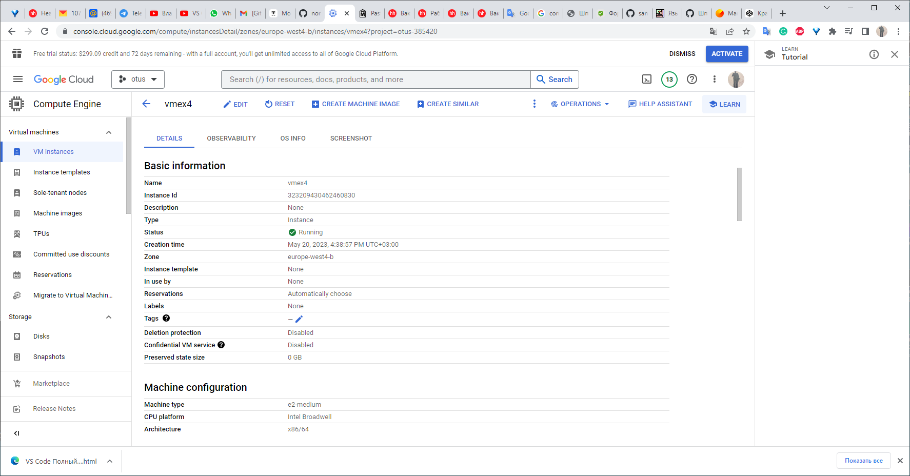

## Home work #4

- **Развернуть Постгрес на ВМ**
  ##### *Создаем VM*
  

#### *Устанавливаем PostgreSQL v15*

gmfcbkaccnt@vmex4:~$ `uname -a`

Linux vmex4 5.10.0-22-cloud-amd64 #1 SMP Debian 5.10.178-3 (2023-04-22) x86_64 GNU/Linux

gmfcbkaccnt@vmex4:~$ `sudo sh -c 'echo "deb http://apt.postgresql.org/pub/repos/apt $(lsb_release -cs)-pgdg main" > /etc/apt/sources.list.d/pgdg.list' `

gmfcbkaccnt@vmex4:~$ `wget --quiet -O - https://www.postgresql.org/media/keys/ACCC4CF8.asc | sudo apt-key add - 

Warning: apt-key is deprecated. Manage keyring files in trusted.gpg.d instead (see apt-key(8)).

OK

gmfcbkaccnt@vmex4:~$  ` sudo apt-get update`

Get:1 http://apt.postgresql.org/pub/repos/apt bullseye-pgdg InRelease [117 kB]

 
*Установка ПО PostgreSQL v15 из репозитария*

gmfcbkaccnt@vmex4:~$ `sudo apt install postgresql-15 postgresql-client-15 -y`

Reading package lists... Done

Building dependency tree... Done

Reading state information... Done

The following additional packages will be installed:

fixing permissions on existing directory /var/lib/postgresql/15/main ... ok

creating subdirectories ... ok

selecting dynamic shared memory implementation ... posix

selecting default max_connections ... 100

selecting default shared_buffers ... 128MB

selecting default time zone ... Etc/UTC

creating configuration files ... ok

running bootstrap script ... ok

performing post-bootstrap initialization ... ok

syncing data to disk ... ok

Setting up libjson-xs-perl (4.030-1+b1) ...

Processing triggers for man-db (2.9.4-2) ...

Processing triggers for libc-bin (2.31-13+deb11u6) ...

*Проверка что кластер запущен*

gmfcbkaccnt@vmex4:~$ `sudo -u postgres pg_lsclusters`

Ver Cluster Port Status Owner    Data directory              Log file

15  main    5432 online postgres /var/lib/postgresql/15/main /var/log/postgresql/postgresql-15-main.log

- **Протестировать pg_bench**

В этом тесте используем VM GCP c 4 ГБ RAM, 2 vCPU, 10 ГБ дискового пространства, управляемую базу данных (только ведущая нода). 

-- Для  целей тестирования создаем новую базу данных.

`CREATE DATABASE bench; `

fcbkaccnt@vmex4:~$ `sudo -u postgres psql`

psql (15.3 (Debian 15.3-1.pgdg110+1))

postgres=# `alter user postgres with password 'zaq1@WSX';`

postgres=# `create database bench;`

CREATE DATABASE

postgres=# `\l`

                                             List of databases

   Name    |  Owner   | Encoding | Collate |  Ctype  | ICU Locale | Locale Provider |   Access privileges   

-----------+----------+----------+---------+---------+------------+-----------------+-----------------------

 bench     | postgres | UTF8     | C.UTF-8 | C.UTF-8 |            | libc            | 

 postgres  | postgres | UTF8     | C.UTF-8 | C.UTF-8 |            | libc            | 

 template0 | postgres | UTF8     | C.UTF-8 | C.UTF-8 |            | libc            | =c/postgres          +

           |          |          |         |         |            |                 | postgres=CTc/postgres

 template1 | postgres | UTF8     | C.UTF-8 | C.UTF-8 |            | libc            | =c/postgres          +

           |          |          |         |         |            |                 | postgres=CTc/postgres

postgres=# `SELECT pg_size_pretty(pg_database_size('bench'));`

 pg_size_pretty 

\----------------

 7369 kB

(1 row)

-- Иницилизируем тестовую базу данных

postgres=`show data_directory;`

data_directory        
\-----------------------------
 /var/lib/postgresql/15/main
(1 row)

postgres@vmex4:/etc/postgresql/15/main$ `pgbench -h 127.0.0.1 -p 5432 -U postgres -i -s 150 bench`

Password: 

dropping old tables...

NOTICE:  table "pgbench_accounts" does not exist, skipping

NOTICE:  table "pgbench_branches" does not exist, skipping

NOTICE:  table "pgbench_history" does not exist, skipping

NOTICE:  table "pgbench_tellers" does not exist, skipping

creating tables...

generating data (client-side)...

15000000 of 15000000 tuples (100%) done (elapsed 38.75 s, remaining 0.00 s)

vacuuming...

creating primary keys...

done in 55.21 s (drop tables 0.00 s, create tables 0.01 s, client-side generate 40.22 s, vacuum 1.20 s, primary keys 13.77 s).

$ `pgbench -i -s 150 bench`

где, 
-i: инициализирует базу данных benchmark с помощью таблиц и их фиктивных данных.

-s (scale): устанавливает масштабный коэффициент 50, который умножит размеры таблицы на 150.
По умолчанию s=1 pgbench создаст таблицы в базе данных размером 16MB. 

Для коэфициента масштабирования s=150 размер тестовых таблиц в БД bench составит 150 x 16MB.

postgres=# `SELECT pg_size_pretty(pg_database_size('bench'));`
 pg_size_pretty

\----------------

 2251\\ MB

(1 row)

postgres=# \c bench

You are now connected to database "bench" as user "postgres".

bench=# \dt

              List of relations

 Schema |       Name       | Type  |  Owner   

--------+------------------+-------+----------

 public | pgbench_accounts | table | postgres

 public | pgbench_branches | table | postgres

 public | pgbench_history  | table | postgres

 public | pgbench_tellers  | table | postgres

(4 rows)

--Запускаем базовый тест для количества сессий в 50, 100 и 150.

`$ pgbench -h 127.0.0.1 -p 5432 -U postgres -c 50 -j 2 -P 60 -T 600 bench`

где,   -c: количество одновременных сеансов БД

-j: количество рабочих потоков, которые pgbench будет использовать во время теста.  По количеству ядер на VM.

-P: отображает прогресс и метрики каждые 60 секунд.

-T: запустит тест на 600 секунд (10 минут). Чтобы получить согласованные, воспроизводимые результаты, важно, чтобы тест длился в течение нескольких минут или один цикл контрольных точек.

postgres@vmex4:/etc/postgresql/15/main$ `pgbench -h 127.0.0.1 -p 5432 -U postgres -c 50 -j 2 -P 60 -T 600 bench`

Password: 

pgbench (15.3 (Debian 15.3-1.pgdg110+1))

starting vacuum...end.

progress: 60.0 s, 1490.2 tps, lat 30.099 ms stddev 32.447, 0 failed

progress: 120.0 s, 1417.0 tps, lat 31.716 ms stddev 41.896, 0 failed

progress: 180.0 s, 1262.6 tps, lat 36.526 ms stddev 85.111, 0 failed

progress: 240.0 s, 1061.4 tps, lat 41.864 ms stddev 52.737, 0 failed

progress: 300.0 s, 897.3 tps, lat 49.017 ms stddev 58.800, 0 failed

progress: 360.0 s, 894.1 tps, lat 49.103 ms stddev 59.906, 0 failed

progress: 420.0 s, 894.6 tps, lat 49.095 ms stddev 59.572, 0 failed

progress: 480.0 s, 893.3 tps, lat 48.945 ms stddev 60.424, 0 failed

progress: 540.0 s, 921.9 tps, lat 47.546 ms stddev 59.017, 0 failed

progress: 600.0 s, 903.5 tps, lat 48.676 ms stddev 60.193, 0 failed

transaction type: <builtin: TPC-B (sort of)>

scaling factor: 150

query mode: simple

number of clients: 50

number of threads: 2

maximum number of tries: 1

duration: 600 s

number of transactions actually processed: 638217

number of failed transactions: 0 (0.000%)

latency average = 41.725 ms

latency stddev = 58.219 ms

initial connection time = 320.583 ms

tps = 1063.735096 (without initial connection time)

postgres@vmex4:/etc/postgresql/15/main$ `pgbench -h 127.0.0.1 -p 5432 -U postgres -c 100 -j 2 -P 60 -T 600 bench`

Password: 

pgbench (15.3 (Debian 15.3-1.pgdg110+1))

starting vacuum...end.

progress: 60.0 s, 1582.8 tps, lat 54.790 ms stddev 44.064, 0 failed

progress: 120.0 s, 1638.7 tps, lat 53.678 ms stddev 44.834, 0 failed

progress: 180.1 s, 1089.1 tps, lat 80.805 ms stddev 84.963, 0 failed

progress: 240.0 s, 867.0 tps, lat 100.305 ms stddev 102.578, 0 failed

progress: 300.1 s, 788.8 tps, lat 109.998 ms stddev 108.725, 0 failed

progress: 360.1 s, 837.8 tps, lat 103.823 ms stddev 100.764, 0 failed

progress: 420.1 s, 853.4 tps, lat 101.930 ms stddev 99.535, 0 failed

progress: 480.1 s, 860.9 tps, lat 101.389 ms stddev 98.118, 0 failed

progress: 540.1 s, 864.8 tps, lat 100.562 ms stddev 100.377, 0 failed

progress: 600.2 s, 857.3 tps, lat 102.064 ms stddev 97.144, 0 failed

transaction type: <builtin: TPC-B (sort of)>

scaling factor: 150

query mode: simple

number of clients: 100

number of threads: 2

maximum number of tries: 1

duration: 600 s

number of transactions actually processed: 614691

number of failed transactions: 0 (0.000%)

latency average = 85.214 ms

latency stddev = 88.353 ms

initial connection time = 704.206 ms

tps = 1024.548163 (without initial connection time)

- **Выставить оптимальные настройки**
- **Проверить насколько выросла производительность**

-- Изменяем параметр буферного кеша shared_buffers

postgres=# show shared_buffers;

 shared_buffers 

\----------------

 128MB

(1 row)

postgres=# `ALTER SYSTEM SET shared_buffers TO '256MB';`

ALTER SYSTEM

postgres=#`select name, setting, min_val, max_val, context from pg_settings where name='shared_buffers';  `

      name      | setting | min_val |  max_val   |  context   

----------------+---------+---------+------------+------------

 shared_buffers | 16384   | 16      | 1073741823 | postmaster

(1 row)

postgres@vmex4:/etc/postgresql/15/main$ `pg_ctlcluster 15 main stop`

postgres@vmex4:/etc/postgresql/15/main$ `pg_ctlcluster 15 main start`

Warning: the cluster will not be running as a systemd service. Consider using systemctl:

  sudo systemctl start postgresql@15-main

postgres@vmex4:/etc/postgresql/15/main$ `pg_ctlcluster 15 main status`

pg_ctl: server is running (PID: 6300)

/usr/lib/postgresql/15/bin/postgres "-D" "/var/lib/postgresql/15/main" "-c" "config_file=/etc/postgresql/15/main/postgresql.conf"

postgres=# `show shared_buffers;`

 shared_buffers 

\---------------

 256MB

(1 row)

--Повторяем тестирование
-- для 50 подключений
postgres@vmex4:/etc/postgresql/15/main$ `pgbench -h 127.0.0.1 -p 5432 -U postgres -c 50 -j 2 -P 60 -T 600 bench`

Password: 

pgbench (15.3 (Debian 15.3-1.pgdg110+1))

starting vacuum...end.

progress: 60.0 s, 1526.8 tps, lat 29.233 ms stddev 20.100, 0 failed

progress: 120.0 s, 1577.8 tps, lat 28.214 ms stddev 21.309, 0 failed

progress: 180.0 s, 1066.8 tps, lat 41.312 ms stddev 51.195, 0 failed

progress: 240.0 s, 792.7 tps, lat 56.445 ms stddev 64.168, 0 failed

progress: 300.0 s, 841.0 tps, lat 52.486 ms stddev 63.469, 0 failed

progress: 360.0 s, 847.5 tps, lat 52.154 ms stddev 63.048, 0 failed

progress: 420.0 s, 858.1 tps, lat 51.254 ms stddev 62.290, 0 failed

progress: 480.0 s, 796.1 tps, lat 55.003 ms stddev 68.309, 0 failed

progress: 540.0 s, 837.0 tps, lat 52.441 ms stddev 63.609, 0 failed

progress: 600.1 s, 853.3 tps, lat 51.255 ms stddev 61.885, 0 failed

transaction type: <builtin: TPC-B (sort of)>

scaling factor: 150

query mode: simple

number of clients: 50

number of threads: 2

maximum number of tries: 1

duration: 600 s

number of transactions actually processed: 599943

number of failed transactions: 0 (0.000%)

latency average = 44.207 ms

latency stddev = 54.007 ms

initial connection time = 330.961 ms

tps = 999.491923 (without initial connection time)

-- для 100 подключений
postgres@vmex4:/etc/postgresql/15/main$ ёpgbench -h 127.0.0.1 -p 5432 -U postgres -c 100 -j 2 -P 60 -T 600 benchё

Password: 

pgbench (15.3 (Debian 15.3-1.pgdg110+1))

starting vacuum...end.

progress: 60.1 s, 1211.9 tps, lat 71.215 ms stddev 72.513, 0 failed

progress: 120.1 s, 822.1 tps, lat 106.122 ms stddev 104.924, 0 failed

progress: 180.1 s, 839.1 tps, lat 104.608 ms stddev 103.710, 0 failed

progress: 240.1 s, 818.6 tps, lat 106.313 ms stddev 103.117, 0 failed

progress: 300.1 s, 826.8 tps, lat 104.817 ms stddev 103.199, 0 failed

progress: 360.1 s, 814.1 tps, lat 106.203 ms stddev 104.633, 0 failed

progress: 420.1 s, 832.9 tps, lat 104.804 ms stddev 102.168, 0 failed

progress: 480.1 s, 753.9 tps, lat 116.306 ms stddev 115.956, 0 failed

progress: 540.1 s, 805.8 tps, lat 108.349 ms stddev 103.963, 0 failed

progress: 600.4 s, 805.7 tps, lat 108.452 ms stddev 102.972, 0 failed

transaction type: <builtin: TPC-B (sort of)>

scaling factor: 150

query mode: simple

number of clients: 100

number of threads: 2

maximum number of tries: 1

duration: 600 s

number of transactions actually processed: 512255

number of failed transactions: 0 (0.000%)

latency average = 102.190 ms

latency stddev = 102.055 ms

initial connection time = 600.230 ms

tps = 853.253335 (without initial connection time)

--Изменим параметр shared_buffers до рекомендованных значений 1\4 ОЗУ

postgres=# `ALTER SYSTEM SET shared_buffers TO '1024MB';`
postgres@vmex4:/etc/postgresql/15/main$ `pg_ctlcluster 15 main stop`
postgres@vmex4:/etc/postgresql/15/main$ `pg_ctlcluster 15 main start`
postgres=# show shared_buffers;

 shared_buffers 

----------------

 1GB

(1 row)

--Повторим тестирование для количества подключений 100.

-- для 100 подключений

postgres@vmex4:/etc/postgresql/15/main$ `gbench -h 127.0.0.1 -p 5432 -U postgres -c 100 -j 2 -P 60 -T 600 bench`

Password: 

pgbench (15.3 (Debian 15.3-1.pgdg110+1))

starting vacuum...end.

progress: 60.0 s, 1614.7 tps, lat 53.393 ms stddev 43.543, 0 failed

progress: 120.1 s, 1505.7 tps, lat 57.928 ms stddev 45.497, 0 failed

progress: 180.0 s, 778.4 tps, lat 112.959 ms stddev 106.260, 0 failed

progress: 240.0 s, 740.3 tps, lat 118.770 ms stddev 113.657, 0 failed

progress: 300.1 s, 769.8 tps, lat 113.772 ms stddev 105.347, 0 failed

progress: 360.1 s, 807.5 tps, lat 109.214 ms stddev 104.506, 0 failed

progress: 420.0 s, 803.7 tps, lat 109.272 ms stddev 104.330, 0 failed

progress: 480.0 s, 800.7 tps, lat 110.250 ms stddev 104.165, 0 failed

progress: 540.0 s, 813.8 tps, lat 108.108 ms stddev 106.855, 0 failed

progress: 600.1 s, 812.2 tps, lat 108.014 ms stddev 104.608, 0 failed

transaction type: <builtin: TPC-B (sort of)>

scaling factor: 150

query mode: simple

number of clients: 100

number of threads: 2

maximum number of tries: 1

duration: 600 s

number of transactions actually processed: 567110

number of failed transactions: 0 (0.000%)

latency average = 92.929 ms

latency stddev = 94.935 ms

initial connection time = 585.634 ms

tps = 943.826016 (without initial connection time)

### Conclusion: Изменение значения `shared_buffers` со `128MB` до `1024MB` в тестовой БД привело к увеличению производительности на `90` транзакций в секунду. Что соответствует увеличение производительности на 10 процентов.

--Изменим параметр work_mem использующися при операциях сортировки 

postgres=# `show work_mem;`

 work_mem

----------

 4MB

(1 row)

postgres=# `ALTER SYSTEM SET work_mem TO '256MB';`

ALTER SYSTEM

postgres=# `\c bench`

bench=# `show work_mem  `                                                

 work_mem

----------

 256MB

(1 row)

postgres@vmex4:/etc/postgresql/15/main$ `pgbench -h 127.0.0.1 -p 5432 -U postgres -c 100 -j 2 -P 60 -T 600 bench`

Password: 

pgbench (15.3 (Debian 15.3-1.pgdg110+1))

starting vacuum...end.

progress: 60.0 s, 1520.5 tps, lat 57.264 ms stddev 42.745, 0 failed

progress: 120.1 s, 1556.2 tps, lat 56.517 ms stddev 41.915, 0 failed

progress: 180.1 s, 765.4 tps, lat 115.544 ms stddev 107.208, 0 failed

progress: 240.1 s, 744.8 tps, lat 118.785 ms stddev 109.290, 0 failed

progress: 300.1 s, 692.6 tps, lat 127.773 ms stddev 119.204, 0 failed

progress: 360.1 s, 772.5 tps, lat 114.256 ms stddev 108.118, 0 failed

progress: 420.1 s, 782.6 tps, lat 112.798 ms stddev 104.190, 0 failed

progress: 480.1 s, 788.9 tps, lat 111.533 ms stddev 105.582, 0 failed

progress: 540.1 s, 789.2 tps, lat 111.282 ms stddev 101.912, 0 failed

progress: 600.1 s, 789.6 tps, lat 111.788 ms stddev 103.664, 0 failed

transaction type: <builtin: TPC-B (sort of)>

scaling factor: 150

query mode: simple

number of clients: 100

number of threads: 2

maximum number of tries: 1

duration: 600 s

number of transactions actually processed: 552386

number of failed transactions: 0 (0.000%)

latency average = 95.825 ms

latency stddev = 95.519 ms

initial connection time = 585.026 ms

tps = 918.623724 (without initial connection time)

--Изменим параметр maintenance_work_mem используемый для задач обслуживания.

postgres=# `show maintenance_work_mem ;`

 maintenance_work_mem 

----------

 64MB

(1 row)

postgres=# `ALTER SYSTEM SET maintenance_work_mem  TO '512MB';`

ALTER SYSTEM

postgres=# `\c bench`

bench=# `show maintenance_work_mem  `                                                

 work_mem

----------

 512MB

(1 row)

postgres@vmex4:/etc/postgresql/15/main$ `pgbench -h 127.0.0.1 -p 5432 -U postgres -c 100 -j 2 -P 60 -T 600 bench`

Password: 

pgbench (15.3 (Debian 15.3-1.pgdg110+1))

starting vacuum...end.

progress: 60.0 s, 1439.4 tps, lat 60.640 ms stddev 45.242, 0 failed

progress: 120.0 s, 1577.5 tps, lat 55.695 ms stddev 41.851, 0 failed

progress: 180.0 s, 797.2 tps, lat 110.362 ms stddev 106.940, 0 failed

progress: 240.0 s, 791.2 tps, lat 110.915 ms stddev 103.519, 0 failed

progress: 300.0 s, 796.0 tps, lat 110.526 ms stddev 110.673, 0 failed

progress: 360.0 s, 800.2 tps, lat 109.414 ms stddev 103.332, 0 failed

progress: 420.0 s, 803.2 tps, lat 109.440 ms stddev 104.616, 0 failed

progress: 480.0 s, 812.3 tps, lat 107.815 ms stddev 104.585, 0 failed

progress: 540.0 s, 814.1 tps, lat 107.875 ms stddev 103.908, 0 failed

progress: 600.0 s, 794.2 tps, lat 110.287 ms stddev 104.745, 0 failed

transaction type: <builtin: TPC-B (sort of)>

scaling factor: 150

query mode: simple

number of clients: 100

number of threads: 2

maximum number of tries: 1

duration: 600 s

number of transactions actually processed: 565597

number of failed transactions: 0 (0.000%)

latency average = 93.169 ms

latency stddev = 93.867 ms

initial connection time = 571.973 ms

tps = 940.881743 (without initial connection time)
### Conclusion: При изменении параметров maintenance_work_mem, work_mem не увидели прироста производительности. Что вызвано характером теста pgbench TPC-like. По причине минимального наличия значимых операций сортировки клиентского процесса, а так же отсутвия операций CREATE INDEX, ADD FOREIGN KEY и ALTER TABLE.

- **Настроить кластер на оптимальную производительность не обращая внимания на стабильность БД**

--Изменим параметр synchronous_commit,checkpoint_timeout, checkpoint_completion_target,autovacuum.

В этом случае транзакция фиксируется без ожидания сброса файла WAL на диск и увеличивается  времени между контрольными точками WAL. Выключиим autovacuum.

postgres=# show autovacuum;

 autovacuum 
\------------
 on
postgres=# `show synchronous_commit;`

 synchronous_commit 

\--------------------

 on

(1 row)

postgres=# `show checkpoint_timeout;`

 checkpoint_timeout 

\--------------------

 5min

(1 row)

postgres=#` show checkpoint_completion_target ;`

 checkpoint_completion_target 

\------------------------------

 0.9

(1 row)

postgres=# `ALTER SYSTEM SET synchronous_commit TO 'off';`

ALTER SYSTEM

postgres=# `ALTER SYSTEM SET checkpoint_timeout TO '20min;`

ALTER SYSTEM

postgres=# `ALTER SYSTEM SET checkpoint_completion_target TO 'off';`

ALTER SYSTEM

postgres=# `ALTER SYSTEM SET autovacuum  TO 'off';`

ALTER SYSTEM

--Запускаем тестирование

postgres@vmex4:/etc/postgresql/15/main$ pgbench -h 127.0.0.1 -p 5432 -U postgres -c 100 -j 2 -P 60 -T 600 bench

Password: 

pgbench (15.3 (Debian 15.3-1.pgdg110+1))

starting vacuum...end.

progress: 60.0 s, 1556.3 tps, lat 53.880 ms stddev 78.035, 0 failed

progress: 120.0 s, 1697.3 tps, lat 50.852 ms stddev 74.133, 0 failed

progress: 180.1 s, 858.1 tps, lat 102.395 ms stddev 173.690, 0 failed

progress: 240.1 s, 883.4 tps, lat 99.054 ms stddev 166.260, 0 failed

progress: 300.1 s, 866.5 tps, lat 101.330 ms stddev 168.171, 0 failed

progress: 360.1 s, 881.1 tps, lat 99.257 ms stddev 163.435, 0 failed

progress: 420.1 s, 875.9 tps, lat 98.848 ms stddev 163.520, 0 failed

progress: 480.1 s, 875.3 tps, lat 99.375 ms stddev 160.739, 0 failed

progress: 540.1 s, 880.4 tps, lat 99.081 ms stddev 156.534, 0 failed

progress: 600.1 s, 880.3 tps, lat 98.517 ms stddev 163.718, 0 failed

transaction type: <builtin: TPC-B (sort of)>

scaling factor: 150

query mode: simple

number of clients: 100

number of threads: 2

maximum number of tries: 1

duration: 600 s

number of transactions actually processed: 615449

number of failed transactions: 0 (0.000%)

latency average = 84.738 ms

latency stddev = 144.370 ms

initial connection time = 642.951 ms

tps = 1025.237162 (without initial connection time)

### Conclusion: Изменение значений папрметров  synchronous_commit,checkpoint_timeout, checkpoint_completion_target,autovacuum в тестовой БД привело к увеличению производительности на `85` транзакций в секунду при тесте TPC-B like. Что соответствует увеличение производительности на 9 процентов. Но одновременно с этим поставило под угрозу сохранность данных при сбоях электропитания, привело к распуханию обьема БД за счет мертвых tuples в строках таблиц и может привести к останову БД в будущем по причине достижения переисользования мах номера транзакции без операций заморозки.
